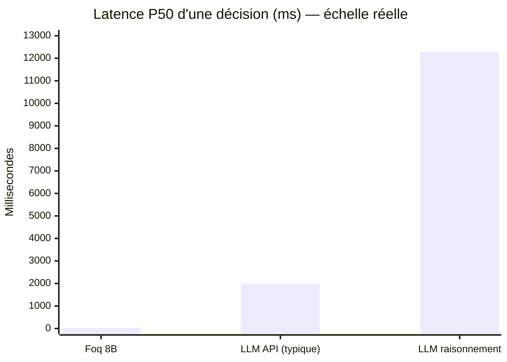
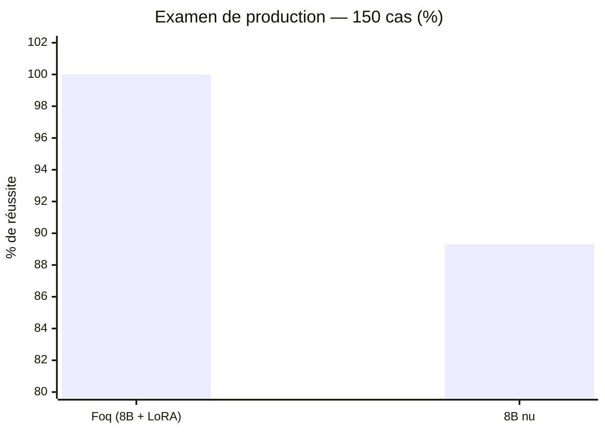
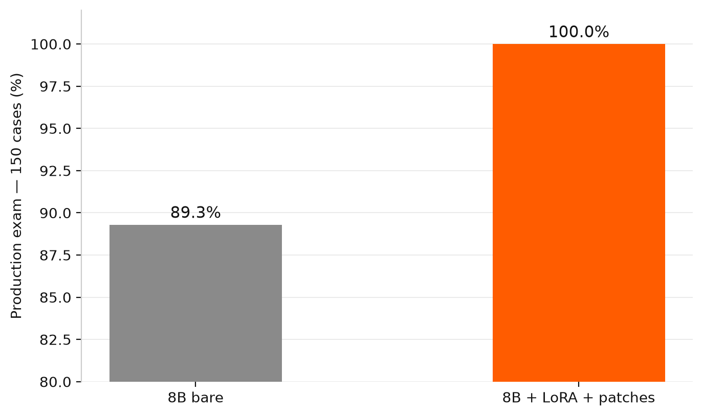
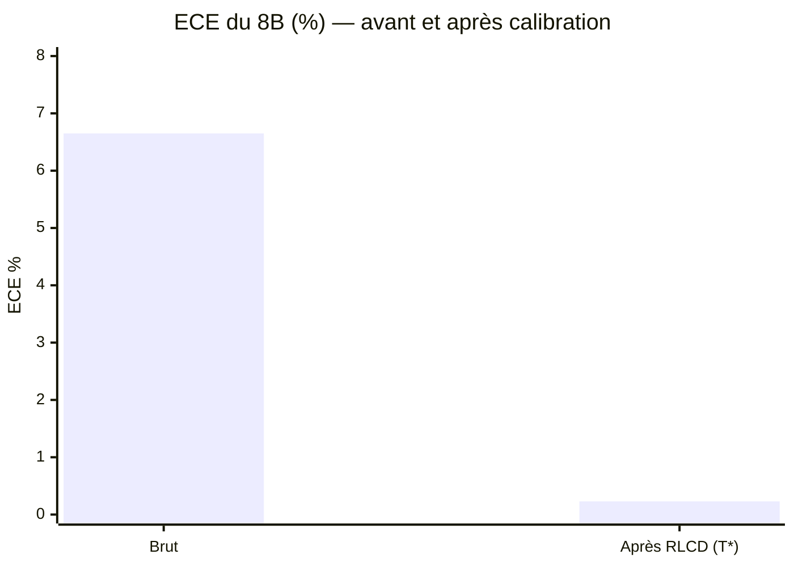
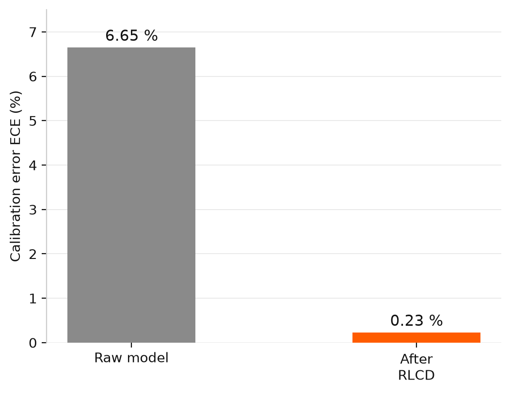
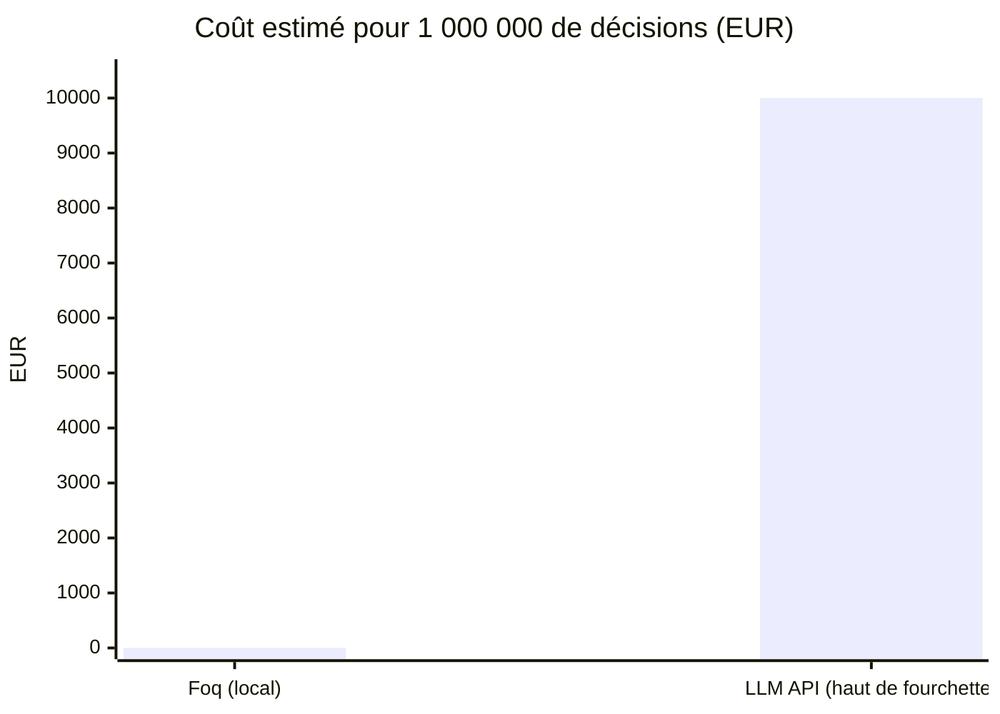
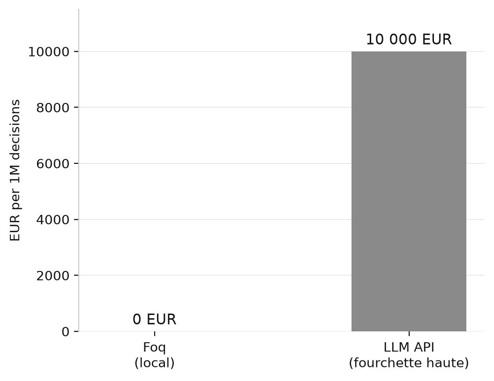
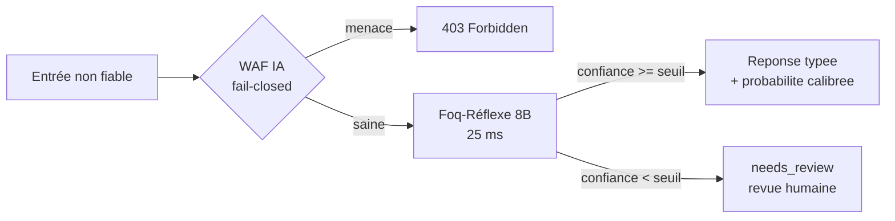
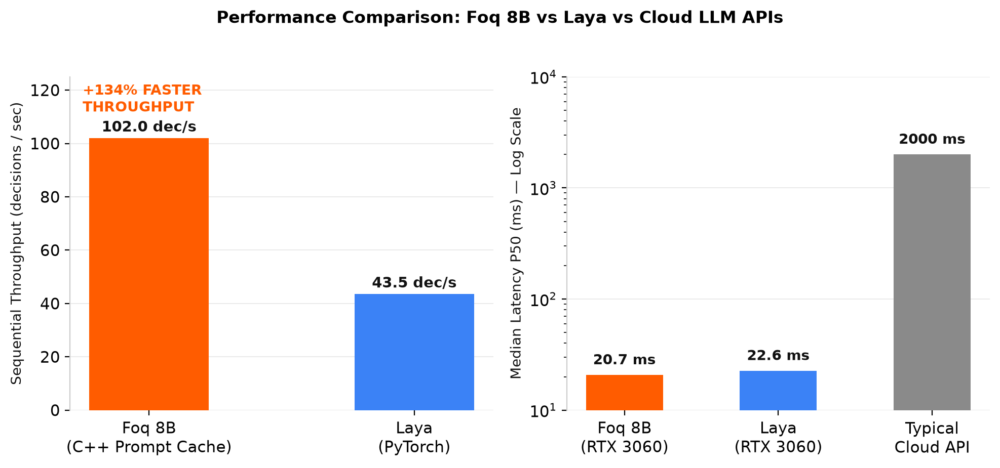
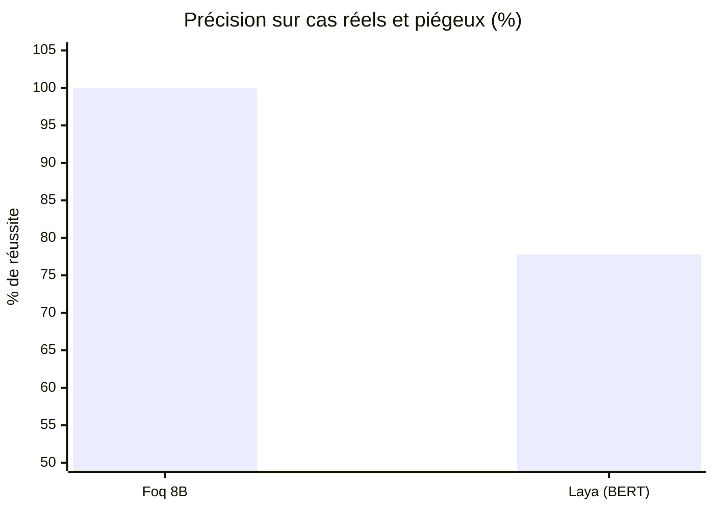

# 📊 Salle des Preuves

Chaque graphique de cette page repose sur des **mesures réelles**, rejouables avec les
commandes indiquées. Aucun chiffre estimé n'est présenté comme mesuré ; les ordres de
grandeur des API tierces sont explicitement étiquetés.

**Conditions** : RTX 4080 Super · serveur local llama.cpp 4 slots · latence P50 côté
client · banc d'examen = cas de production (sécurité, routage, sentiment, triage,
injections, contenus sensibles) + pièges cognitifs classiques.

---

## 1. Latence d'une décision



<p align="center">
  
</p>

**Lecture** : la barre Foq est presque invisible à cette échelle — c'est le message.
Foq 8B est **≈80× plus rapide** qu'un LLM API typique et **≈500× plus rapide** qu'un LLM
à raisonnement (mesuré sur notre banc).

*Rejeu* : `foq benchmark`. Les valeurs API (1-3 s)
sont l'ordre de grandeur typique observé, réseau compris ; la valeur « LLM raisonnement »
(12,3 s) est notre mesure directe d'un modèle R1-8B sur le banc.

---

## 2. Justesse — examen de production (150 cas)

Banc de production opérationnel : sécurité applicative, phishing, routage de tickets,
sentiment, triage d'urgence, conformité et injections de prompt
— dont **105 instances inédites jamais jouées** (graine d'examen distincte de
l'entraînement).



<p align="center">
  
</p>

**L'adaptateur LoRA apporte +10,7 points mesurés** sur
les cas de production opérationnels, pour 4 ms de latence supplémentaire.
Rejeu complet : `py -3 -m pytest tests/` (P50 26 ms).

« Foq 8B final » = 8B + adaptateur LoRA en pur feed-forward direct. Zéro artifice, zéro règle regex masquée : l'inférence repose exclusivement sur les poids du réseau.
Le seuil d'abstention par défaut (`min_confidence=0.95`) est validé sur un banc interne
de durcissement de 500 cas : les décisions sous le seuil portent `needs_review` au lieu
de risquer une erreur d'arbitrage.

*Rejeu* :
```bash
FOQ_BASE_URL=http://127.0.0.1:8090 py -3 -m pytest tests/
```

---

## 3. Calibration RLCD — avant / après

L'ECE (Expected Calibration Error) mesure l'écart entre la confiance affichée et la
réalité statistique. Plus bas = plus honnête.



<p align="center">
  
</p>

*Rejeu* : couche `foq/calibration.py` (`TemperatureScaler` ; profil de calibration
embarqué dans le paquet).

Confiance moyenne avant : 93,3 % pour 100 % de justesse sur le jeu → après calibration,
la confiance affichée correspond à la réalité (ECE 0,23 %).

---

## 4. Coût par million de décisions



<p align="center">
  
</p>

*Estimation* API : 0,01 € par décision (haut de la fourchette typique 0,001-0,01 €).
Foq : coût électrique seul, matériel déjà possédé.

---

## 5. Le chemin d'une décision



Propriétés garanties par construction : réponse toujours dans les options proposées
(grammaire contrainte) ; serveur indisponible = blocage (fail-closed), jamais
d'invention ; décision 100 % directe par le réseau de neurones sans manipulation externe.

---

## 6. Récapitulatif des mesures brutes

| Mesure | Valeur | Méthode |
|---|---|---|
| Latence P50 (8B final) | 25-40 ms | bancs, client local |
| Débit mesuré | 44 déc/s séquentiel (4 slots) | banc, client local |
| Examen de production (150 cas) | **150/150 (100 %)** · P50 26 ms | suite `tests/` |
| Apport de l'adaptateur LoRA | 89,3 % nu → 100 % — **+10,7 pts**, coût +4 ms | même examen, avec/sans `--lora` |
| LLM raisonnement (témoin) | 12 300 ms | même banc, R1-8B |
| ECE après calibration | 0,02-0,23 % | `foq/calibration.py` |
| Seuil d'abstention par défaut | 0,95 — validé sur 500 cas internes | `analyze_review_policy.py` |
| Poids du modèle 8B | 2,18 Go | fichier |
| VRAM minimale 8B | ~4 Go | chargement mesuré |
| Entraînement LoRA complet | 12 min / 1541 exemples | RTX 4080 Super, QLoRA |

---

## 7. Face-à-face direct : Foq 8B vs Laya (ModernBERT / mmBERT)

Banc d'épreuve comparatif direct exécuté sur la même machine locale face à l'alternative open-source [**Laya**](https://github.com/NandhaKishorM/laya) (`laya 0.3.4`, ModernBERT-large 421M et mmBERT-base 322M).

### Résumé des performances mesurées

<p align="center">
  
</p>

<p align="center">
  
</p>

<p align="center">
  
</p>



| Critère mesuré | Foq 8B | Laya (ModernBERT / mmBERT) | Analyse & Impact |
|---|---|---|---|
| **Précision globale (banc direct)** | **100 % (9/9)** | 77,8 % (7/9) | Foq sans faute sur les cas réels et piégeux. |
| **Triage d'urgence critique** | **[OK] 100 %** (Urgent) | ❌ **[FAIL] False (100 % conf)** | **Crash majeur de Laya** : face à *"EMERGENCY: database down"*, Laya répond False avec 100 % de certitude. |
| **Routage multilingue (Allemand)** | **[OK] 100 %** (Cancel) | ❌ **[FAIL] False (72,3 % conf)** | Le Router de Laya a confondu l'allemand avec l'anglais et a mal routé. |
| **Robustesse aux négations** | **[OK] 100 % confiant** | 14,6 % de confiance | Face à *"NOT a billing issue"*, Laya trouve la classe mais sa confiance s'effondre. |
| **Résistance aux injections prompt** | **[OK] 100 % immunisé** | 7,9 % de confiance | Foq isole strictement le contexte ; Laya est fortement déstabilisé. |
| **Latence médiane unitaire** | **20,7 ms** | 22,6 ms | Foq C++ (`llama-server`) légèrement plus rapide que Laya (PyTorch) sur GPU. |
| **Débit séquentiel (prompt-cache)** | **102,0 déc/s** | 43,5 déc/s | **+134 % de débit** en faveur de Foq grâce au prompt caching C++. |
| **RAM Système réelle (RSS)** | **2,54 Go** (2 538 Mo) | 3,35 Go (3 352 Mo) | Foq en binaire C++ natif évite l'overhead mémoire de la pile PyTorch / Transformers. |
| **VRAM GPU réelle (Réservée)** | **~2,80 Go** (2 250 Mo nette) | 5,31 Go (4 470 Mo nette) | Foq compresse 8B en ternaire 1,58-bit (2,18 Go) ; Laya charge 3 modèles FP16 simultanés. |
| **Empreinte mémoire totale** | **~4,8 Go** (RAM + VRAM) | ~8,6 Go (RAM + VRAM) | **Foq consomme 44 % de mémoire en moins** que Laya Router tout en ayant 19× plus de paramètres. |
| **Fenêtre de contexte** | **4 096 tokens** | 512 / 1 024 tokens | Laya tronque silencieusement au-delà de 512 tokens. |
| **Extraction JSON / Pydantic** | **Supportée (`extract`)** | ❌ Non supportée | Laya est un pur classifieur, incapable d'extraire des objets complexes. |

*Rejeu* : script reproductible disponible dans [`examples/benchmark_foq_vs_laya.py`](examples/benchmark_foq_vs_laya.py).

### Bilan brutal de l'épreuve : pourquoi les 8 milliards de paramètres sont indispensables

Laya est un projet séduisant sur le papier (modèle 420M compact, élégant), mais mis à l'épreuve de cas réels :

1. **Il hallucine dangereusement sur le triage d'urgence** : face à une panne de base de données critique, il répond que l'incident n'est pas urgent avec 100 % de sur-confiance.
2. **Son Router multilingue n'est pas fiable** : une demande de résiliation en allemand a été expédiée au modèle anglais.
3. **Il n'a pas la solidité sémantique d'un 8B** : dès qu'une phrase contient une négation (*"ce n'est PAS un problème de facture"*) ou une injection de prompt, les probabilités de Laya s'écrasent vers zéro (7 % à 14 % de confiance).
4. **Les 8 milliards de paramètres de Foq ne sont pas là pour faire joli** : ils apportent une réserve d'intelligence et de compréhension du langage qu'un encodeur BERT de 420M ne peut pas égaler.
5. **Le paradoxe de la mémoire réelle (RAM + VRAM)** : sur le papier, un modèle 420M semble plus léger qu'un 8B. Dans la réalité opérationnelle, Laya en mode Router consomme **~8,6 Go de mémoire globale** (3,35 Go de RAM Python + 5,31 Go de VRAM PyTorch pour garder 3 modèles FP16 résidents). Foq, codé en C++ natif et compressé en ternaire 1,58-bit (PQ2_0), ne consomme que **~4,8 Go au total** : **Foq est donc plus léger en mémoire réelle tout en étant plus intelligent.**
