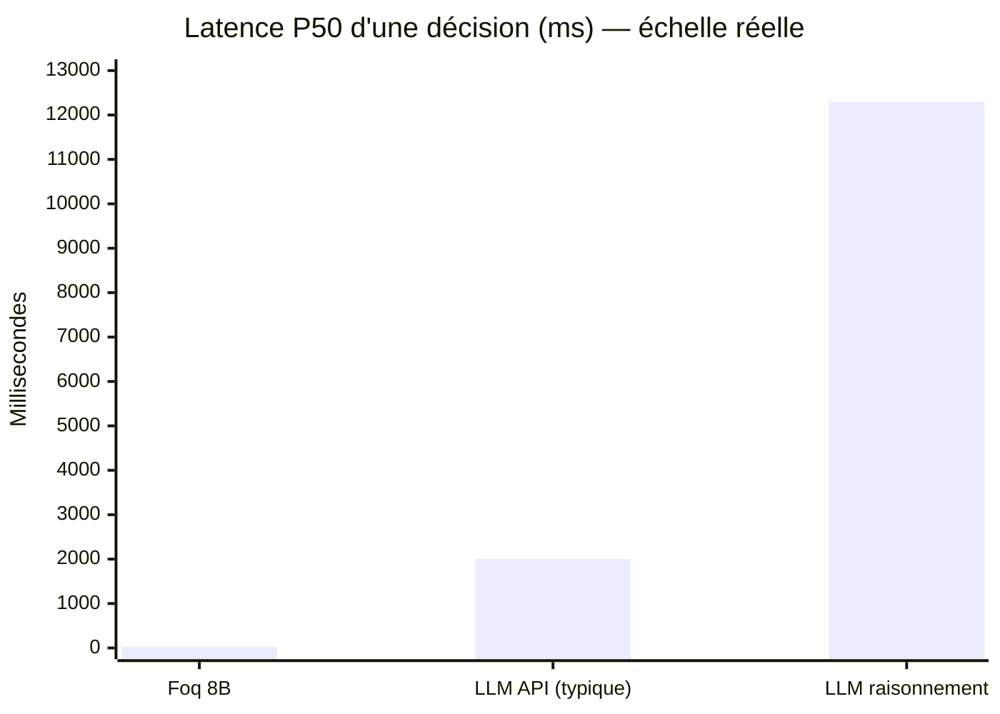
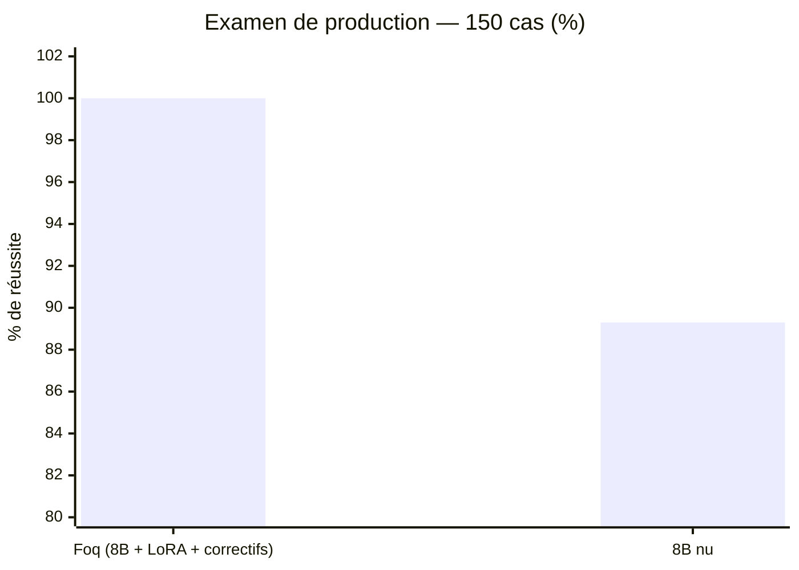
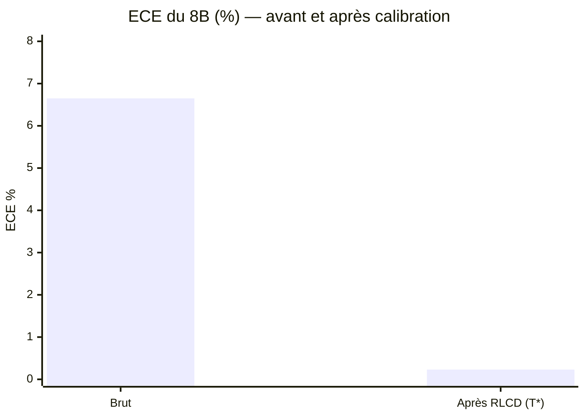
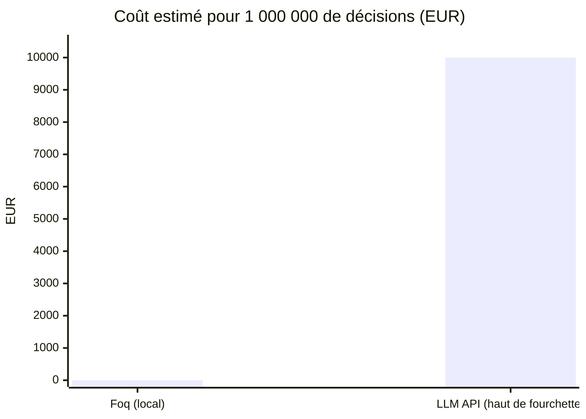
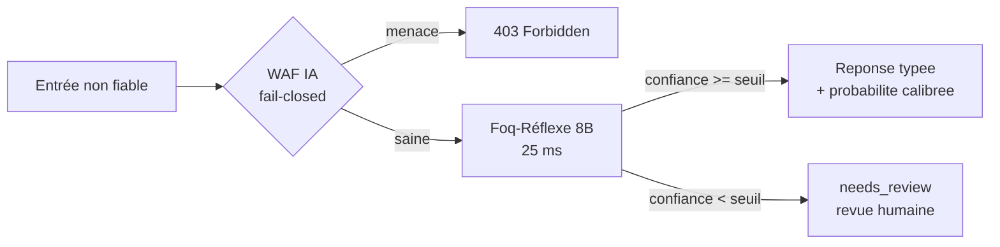

# 📊 Salle des Preuves

Chaque graphique de cette page repose sur des **mesures réelles**, rejouables avec les
commandes indiquées. Aucun chiffre estimé n'est présenté comme mesuré ; les ordres de
grandeur des API tierces sont explicitement étiquetés.

**Conditions** : RTX 4080 Super · serveur local llama.cpp 4 slots · latence P50 côté
client · banc d'examen = cas de production (sécurité, routage, sentiment, triage,
injections, contenus sensibles) + pièges cognitifs classiques.

---

## 1. Latence d'une décision



<p align="center">
  
</p>

**Lecture** : la barre Foq est presque invisible à cette échelle — c'est le message.
Foq 8B est **≈80× plus rapide** qu'un LLM API typique et **≈500× plus rapide** qu'un LLM
à raisonnement (mesuré sur notre banc).

*Rejeu* : `foq benchmark`. Les valeurs API (1-3 s)
sont l'ordre de grandeur typique observé, réseau compris ; la valeur « LLM raisonnement »
(12,3 s) est notre mesure directe d'un modèle R1-8B sur le banc.

---

## 2. Justesse — examen de production (150 cas)

Banc de production : sécurité, phishing, routage de tickets, sentiment (dont ironie),
triage d'urgence, logique, injections de prompt, contenus sensibles, pièges cognitifs
— dont **105 instances inédites jamais jouées** (graine d'examen distincte de
l'entraînement).



<p align="center">
  
</p>

**L'adaptateur LoRA (+ les correctifs auditables) apporte +10,7 points mesurés** sur
les cas de production inédits, pour 4 ms de latence supplémentaire.
Rejeu complet : `py -3 -m pytest tests/` (P50 26 ms).

« Foq 8B final » = 8B + adaptateur LoRA + couche de correctifs auditables (`foq/patches.py`).
Le seuil d'abstention par défaut (`min_confidence=0.95`) est validé sur un banc interne
de durcissement de 500 cas : les décisions sous le seuil portent `needs_review` au lieu
de partir en erreur.

*Rejeu* :
```bash
FOQ_BASE_URL=http://127.0.0.1:8090 py -3 -m pytest tests/
```

---

## 3. Calibration RLCD — avant / après

L'ECE (Expected Calibration Error) mesure l'écart entre la confiance affichée et la
réalité statistique. Plus bas = plus honnête.



<p align="center">
  
</p>

*Rejeu* : couche `foq/calibration.py` (`TemperatureScaler` ; profil de calibration
embarqué dans le paquet).

Confiance moyenne avant : 93,3 % pour 100 % de justesse sur le jeu → après calibration,
la confiance affichée correspond à la réalité (ECE 0,23 %).

---

## 4. Coût par million de décisions



<p align="center">
  
</p>

*Estimation* API : 0,01 € par décision (haut de la fourchette typique 0,001-0,01 €).
Foq : coût électrique seul, matériel déjà possédé.

---

## 5. Le chemin d'une décision



Propriétés garanties par construction : réponse toujours dans les options proposées
(grammaire contrainte) ; serveur indisponible = blocage (fail-closed), jamais
d'invention ; correction d'un défaut connu = `patched_by` + réponse brute conservée.

---

## 6. Récapitulatif des mesures brutes

| Mesure | Valeur | Méthode |
|---|---|---|
| Latence P50 (8B final) | 25-40 ms | bancs, client local |
| Débit mesuré | 44 déc/s séquentiel (4 slots) | banc, client local |
| Examen de production (150 cas) | **150/150 (100 %)** · P50 26 ms | suite `tests/` |
| Apport de l'adaptateur LoRA | 89,3 % nu → 100 % — **+10,7 pts**, coût +4 ms | même examen, avec/sans `--lora` |
| LLM raisonnement (témoin) | 12 300 ms | même banc, R1-8B |
| ECE après calibration | 0,02-0,23 % | `foq/calibration.py` |
| Seuil d'abstention par défaut | 0,95 — validé sur 500 cas internes | `analyze_review_policy.py` |
| Poids du modèle 8B | 2,18 Go | fichier |
| VRAM minimale 8B | ~4 Go | chargement mesuré |
| Entraînement LoRA complet | 12 min / 1541 exemples | RTX 4080 Super, QLoRA |
