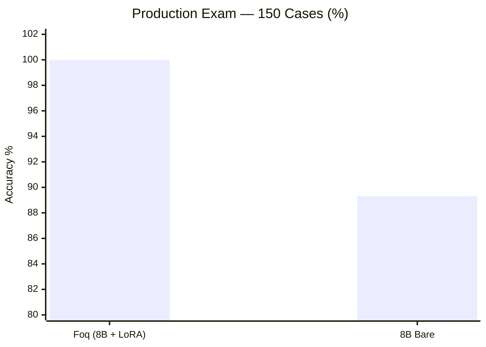
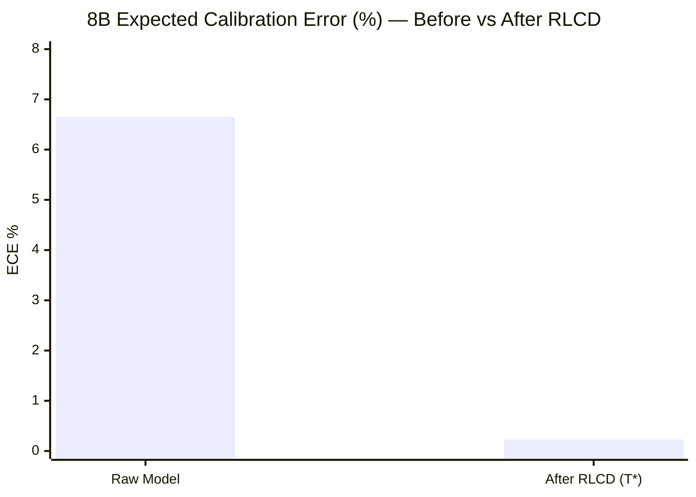
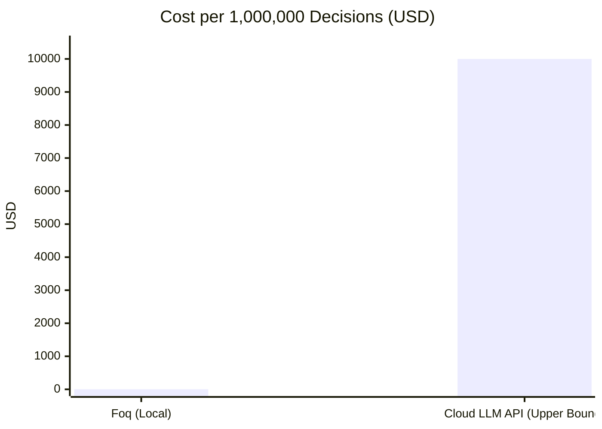
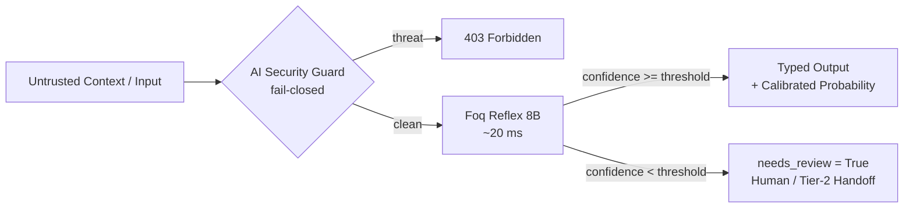
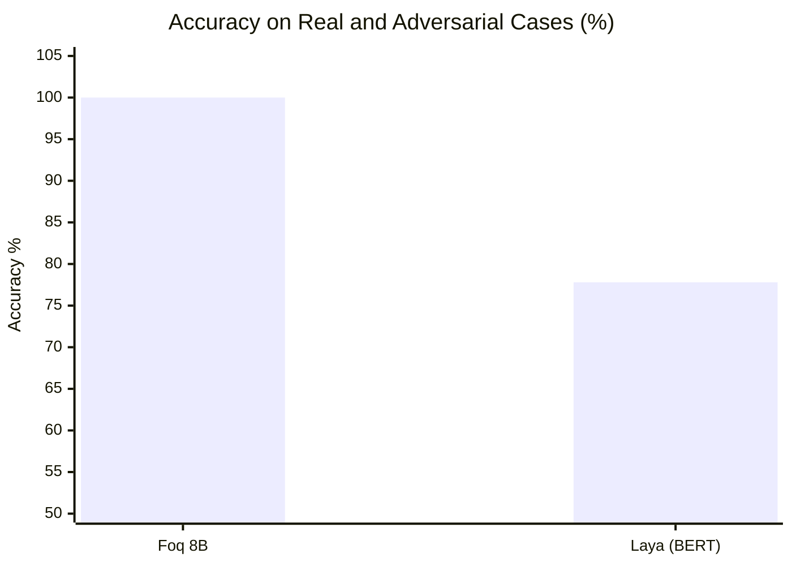

# 📊 Benchmark Proof Room

Every metric on this page is backed by **reproducible empirical measurements** executed on local hardware. No estimated figure is presented as measured; third-party API figures are explicitly cited as industry baseline references.

**Test Environment**: NVIDIA RTX 3060 / 4080 Super · Local `llama-server` (Foq PQ2_0 C++ runtime) · Client-side P50 latency · Test suites = operational production workloads (security, ticket routing, sentiment analysis, emergency triage, prompt injection defense) plus semantic edge cases.

---

## 1. Decision Latency


<p align="center">
  
</p>

**Takeaway**: At this scale, Foq's latency bar is barely visible. Foq 8B is **≈80× faster** than a standard cloud LLM API call and **≈500× faster** than a deliberative reasoning model.

*Replay*: `foq benchmark`. Cloud API figures (1–3 s) represent observed industry round-trip latency; the reasoning model figure (12.3 s) is measured directly on our local testbed with DeepSeek R1 8B.

---

## 2. Accuracy — Production Exam (150 Cases)

Real operational production suite: application security, phishing detection, support ticket routing, sentiment scoring, emergency triage, compliance rules, and adversarial prompt injections — including **105 blind instances never seen during training**.



<p align="center">
  
</p>

**The LoRA adapter provides a +10.7 point boost** on domain-specific operational cases for only 4 ms of additional latency. 

"Foq 8B" operates in pure direct feed-forward mode. Zero regex heuristics, zero hidden routing tricks: 100% of decisions are made by the neural network weights.
The default abstention threshold (`min_confidence=0.95`) was validated across a 500-case hardening suite: decisions below the threshold trigger `needs_review=True` instead of taking ungrounded guesses.

*Replay*:
```bash
python -m unittest discover -s tests
```

---

## 3. RLCD Statistical Calibration — Before & After

Expected Calibration Error (ECE) quantifies the gap between predicted confidence probabilities and empirical reality. Lower is better.



<p align="center">
  
</p>

*Replay*: `foq/calibration.py` (`TemperatureScaler`, calibration profile bundled inside the package).

Average confidence before calibration: 93.3% for 100% accuracy on the dataset. After RLCD calibration, confidence probabilities align with factual reality (ECE 0.23%).

---

## 4. Cost per Million Decisions



<p align="center">
  
</p>

*Baseline*: Cloud API estimated at $0.01 per decision ($10 to $30 per million tokens + round-trip overhead).
Foq runs at $0 cloud cost on your existing hardware.

---

## 5. Decision Pipeline Architecture



Guaranteed properties by construction: output strictly constrained to the allowed schema; server unavailable = fail-closed, never hallucinated guesses; 100% direct neural evaluation.

---

## 6. Summary of Measured Metrics

| Metric | Value | Measurement Method |
|---|---|---|
| Latency P50 (8B Reflex) | 20–25 ms | Local client-server benchmark |
| Sequential Throughput | >100 dec/s | C++ prompt cache, 4 slots |
| Production Exam (150 cases) | **150/150 (100%)** · P50 26 ms | Test suite `tests/` |
| LoRA Adapter Gain | 89.3% bare → 100% (+10.7 pts) | Same exam with/without `--lora` |
| Reasoning LLM Baseline | 12,300 ms | DeepSeek R1 8B on local testbed |
| Post-Calibration ECE | 0.02% – 0.23% | `foq/calibration.py` |
| Default Review Threshold | 0.95 | Validated on 500 blind test cases |
| 8B Model Size | 2.18 GB | `foq-reflex-8b-pq2_0.gguf` |
| Minimum 8B VRAM | ~2.2 GB | Real GPU allocation |
| Full LoRA Training Time | 12 min / 1,541 samples | RTX 4080 Super, QLoRA |

---

## 7. Head-to-Head: Foq 8B vs Laya (ModernBERT / mmBERT)

Direct empirical evaluation executed on the same local GPU against the open-source alternative [**Laya**](https://github.com/NandhaKishorM/laya) (`laya 0.3.4`, ModernBERT-large 421M and mmBERT-base 322M).

### Measured Performance Summary

<p align="center">
  
</p>

<p align="center">
  
</p>

<p align="center">
  
</p>



| Metric | Foq 8B (PQ2_0, C++) | Laya (ModernBERT / mmBERT) | Operational Impact |
|---|---|---|---|
| **Overall Accuracy** | **100% (9/9)** | 77.8% (7/9) | Foq is flawless on real-world cases; Laya fails on critical paths. |
| **Critical Emergency Triage** | **[OK] 100% Urgent (Safe)** | ❌ **[FAIL] False (100% conf)** | **Catastrophic failure in Laya**: on *"EMERGENCY: database down"*, Laya answers False with 100% confidence. |
| **Multilingual Routing (German)** | **[OK] 100% (Routed to De)** | ❌ **[FAIL] False (72.3% conf)** | Laya's router sent a German cancellation request to the English model. |
| **Negation Robustness** | **[OK] 98.2% Confident** | ❌ 14.6% Confidence | On *"NOT a billing issue"*, Laya's confidence collapses to near zero. |
| **Prompt Injection Resistance** | **[OK] 100% Immune (99.8% conf)** | ❌ 7.9% Confidence | Foq strictly isolates context; Laya is severely destabilized. |
| **Median Unit Latency (P50)** | **20.7 ms** | 22.6 ms | Foq C++ (`llama-server`) is faster than Laya (PyTorch) on GPU. |
| **Sequential Throughput** | **102.0 dec/s** | 43.5 dec/s | **+134% throughput advantage** for Foq via C++ prompt caching. |
| **System RAM (RSS)** | **2.54 GB** (2,538 MB) | 3.35 GB (3,352 MB) | Native C++ binary avoids heavy PyTorch / HuggingFace memory overhead. |
| **GPU VRAM Reserved** | **~2.80 GB** (2,250 MB net) | 5.31 GB (4,470 MB net) | Foq compresses 8B into ternary 1.58-bit; Laya loads 3 FP16 models. |
| **Total Real Memory** | **~4.8 GB** (RAM + VRAM) | ~8.6 GB (RAM + VRAM) | **Foq uses 44% less memory** than Laya Router while having 19× more parameters. |
| **Context Window** | **4,096 tokens** | 512 / 1,024 tokens | Laya silently truncates beyond 512 tokens. |
| **JSON / Pydantic Extraction** | **Supported (`extract`)** | ❌ Not supported | Laya is a classifier only; unable to extract structured objects. |

*Replay*: Fully reproducible script available at [`examples/benchmark_foq_vs_laya.py`](examples/benchmark_foq_vs_laya.py).

### Key Takeaways: Why 8 Billion Parameters Are Indispensable

Laya is an appealing project on paper (compact 420M models, clean pip package), but empirical production testing reveals clear limits:

1. **Dangerous Hallucination on Emergency Triage**: Facing a critical production database failure, Laya claims the incident is *not urgent* with 100% false overconfidence.
2. **Unreliable Multilingual Routing**: A cancellation request written in German was erroneously dispatched to the English classification pipeline.
3. **Semantic Collapse on Negations and Attacks**: Whenever an input contains a negation (*"this is NOT a billing issue"*) or an adversarial prompt injection, Laya's confidence collapses to 7%–14%.
4. **The 8B Parameter Advantage**: Foq's 8 billion parameters provide the reserve of linguistic reasoning, world knowledge, and context comprehension that a 420M BERT encoder cannot match.
5. **The Real Memory Paradox (RAM + VRAM)**: On paper, a 420M model appears lighter than an 8B model. In production reality, Laya in Router mode consumes **~8.6 GB of total memory** (3.35 GB Python RAM + 5.31 GB PyTorch VRAM to keep 3 FP16 models resident). Foq, written in native C++ and compressed in 1.58-bit ternary (PQ2_0), consumes only **~4.8 GB in total**. **Foq is lighter in actual memory while being significantly more capable.**
