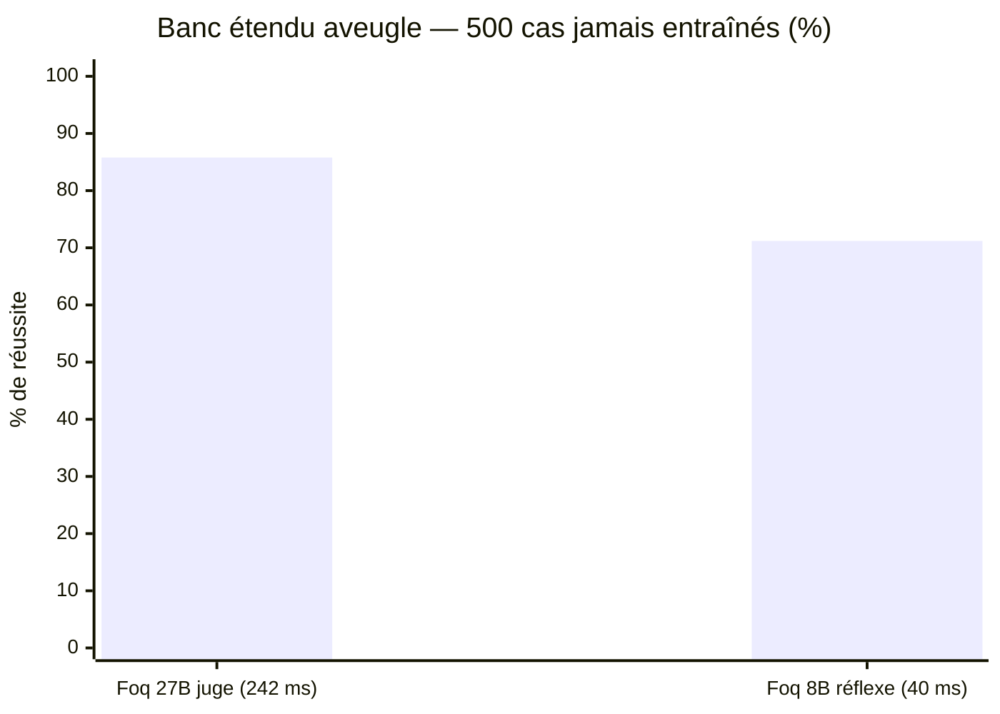
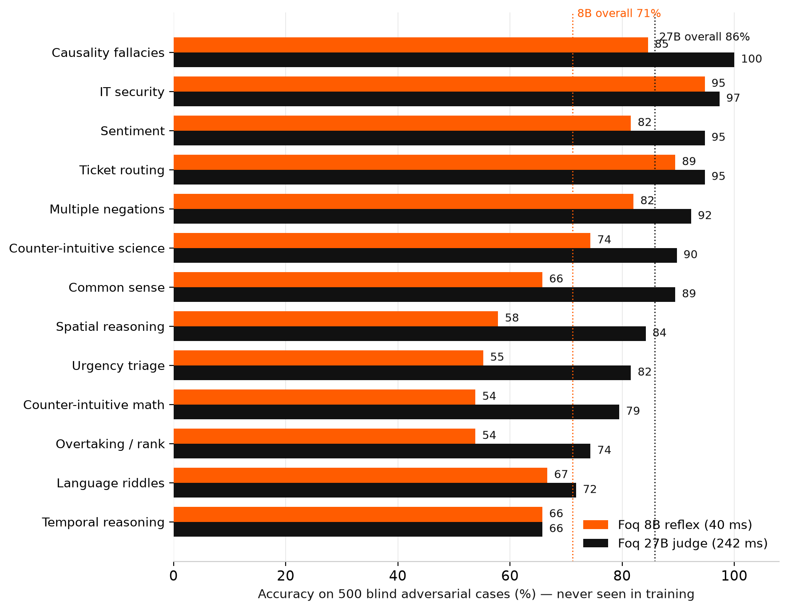
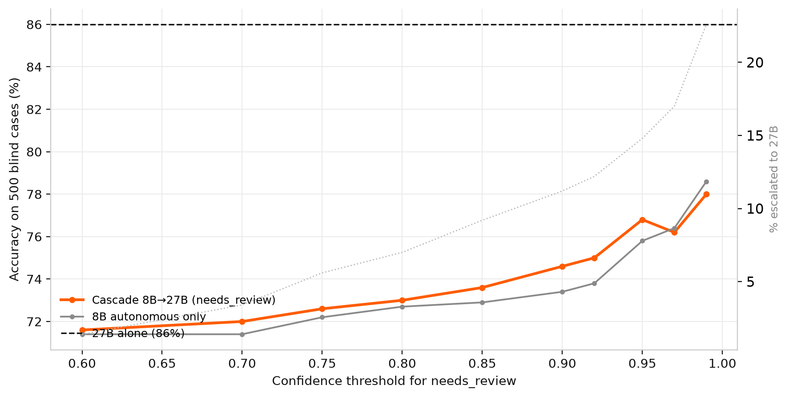

# 🔬 Banc Interne de Durcissement (document d'ingénierie — non destiné au marketing)

> Usage interne : mesurer les limites du 8B hors distribution pour orienter les
> correctifs (`foq/patches.py`), le seuil d'abstention et les priorités d'entraînement.
> Ces chiffres sont des outils de travail, pas des arguments commerciaux.

### 2b. Banc étendu aveugle (500 cas adversariaux jamais entraînés)

500 cas externes vérifiés à l'aveugle, **excluant par hachage tout item vu par
l'adaptateur de production**. C'est la mesure honnête de généralisation hors distribution :



<p align="center">
  
</p>

**Correctifs** : KI-001/002/003 (dépassement, pourcentages en chaîne, fuseaux) ajoutent +0,4 pt mesuré —
les erreurs résiduelles sont diverses, non calculables. **Lecture par catégorie (8B / 27B)** : sécurité 95/97 · routage 89/95 · sentiment 82/95 ·
négations 82/92 · causalité 85/100 · physiologie 74/90 · sens commun 66/89 · énigmes 67/72 ·
spatial 58/84 · temporel 63/66 · triage 55/82 · maths 51/79 · dépassement 54/74.

**Interprétation** : sur le métier décisionnel (sécurité, routage, sentiment), le 8B est
déjà au niveau (82-95 %) à 40 ms. Les catégories de raisonnement pur sont le domaine du
27B — c'est exactement ce que le seuil `min_confidence` exploite : les cas sous confiance
partent en revue au lieu de partir en erreur.

*Rejeu* :
```bash
start_foq_8b_server.cmd   # (avec LORA_PATH) puis :
py -3 scripts/bench_extended.py --base-url http://127.0.0.1:8090 --n 500
py -3 scripts/bench_extended.py --base-url http://127.0.0.1:8089 --n 500 --out data_extended_27b.json
```
*Caveat* : les libellés des 500 cas ont été vérifiés par le 27B (juge) — un biais de
sélection en sa faveur est possible sur les items limites ; le chiffre du 8B, lui,
n'a aucun biais de ce type.

---

## 3. Politique d'abstention mesurée (`needs_review`)

Balayage du seuil de confiance sur les 500 cas aveugles appariés (escalade = réponse
du 27B mesurée sur le même cas) :

| Seuil | Autonome | Escalade | Justesse cascade | Latence moyenne |
|---|---|---|---|---|
| 0 (8B seul) | 100 % | 0 % | 71,2 % | 42 ms |
| 0,80 | 93,0 % | 7,0 % | 73,0 % | 57 ms |
| **0,95 (défaut)** | 85,2 % | 14,8 % | **76,8 %** | **73 ms** |
| 0,99 | 77,4 % | 22,6 % | 78,0 % | 88 ms |
| 27B seul (référence) | 0 % | 100 % | 86,0 % | 246 ms |

<p align="center">
   justesse cascade vs 27B seul" width="820">
</p>

**Limite honnête, mesurée** : le 8B perd ou égale le 27B sur les 13 catégories du banc
(meilleur cas : 95 % vs 97 %) — aucune politique de routage ne peut donc dépasser 86,0 %
ici ; l'optimum de la cascade est l'égalité, atteinte en déléguant presque tout au 27B.
Le rôle du seuil est le compromis : **+5,6 points de justesse à 1/3 de la latence** du 27B.
Sur le banc cœur de production (45 cas), le 8B final reste à 100 %, à égalité avec le 27B.

